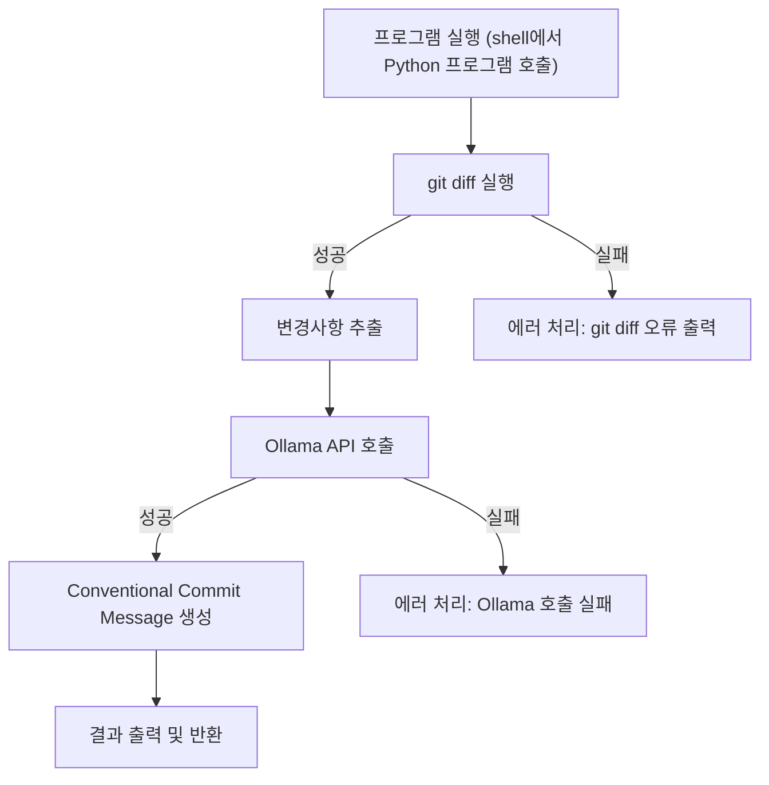

# generate-commit

```mermaid
flowchart TD
    A["프로그램 실행 (shell에서 Python 프로그램 호출)"] --> B[git diff 실행]
    B -->|성공| C[변경사항 추출]
    B -->|실패| Z[에러 처리: git diff 오류 출력]
    C --> D[Ollama API 호출]
    D -->|성공| E[Conventional Commit Message 생성]
    D -->|실패| Y[에러 처리: Ollama 호출 실패]
    E --> F[결과 출력 및 반환]
```
